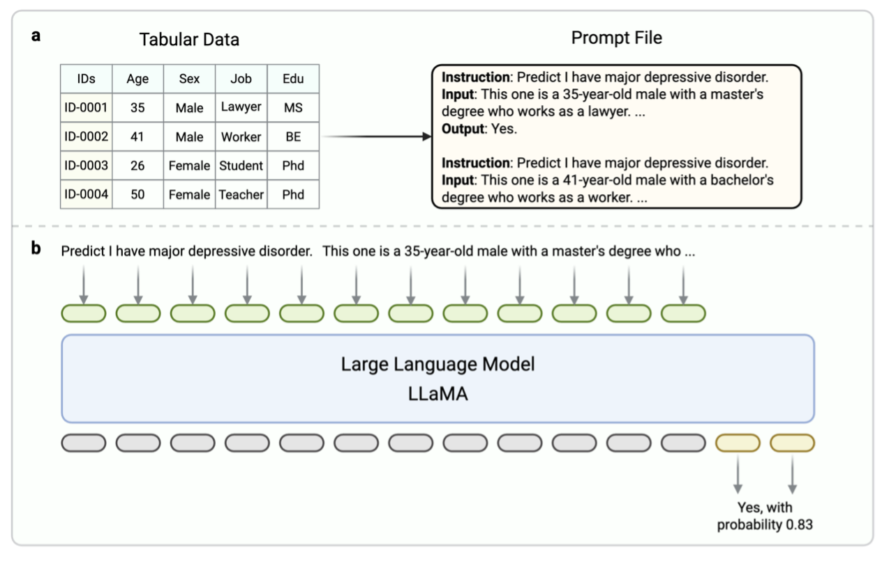

# MDD-LLM: Towards Accuracy Large Language Models for Major Depressive Disorder Diagnosis


## Introduction
This paper introduces a high-performance MDD diagnosis tool named MDD-LLM, an AI-driven framework that utilizes fine-tuned large language models (LLMs) and extensive real-world samples to tackle challenges in MDD diagnosis. Results indicate that LLMs-driven schemes offer significant potential for accuracy, robustness, and interpretability in MDD diagnosis compared to traditional model-based solutions.

## Main Structure
The architecture of proposed MDD-LLM is shown in follow. Figure 1a demonstrate the tabular data transformation process. Figure 1b defines the overview of MDD-LLM. The generated prompt information is tokenized and embedding into the token embedding space. Then the proposed MDD-LLM should give the prediction result and probability by the inputs. 



## Mian Results
We conduct extensive experiments on UKBiobank cohort. The model performance was evaluated using the *Accuracy (Acc)*, *F1-Score (F1)*, *Area Under the Curve (AUC)*, *Specificity (SPE)*, *Sensitivity (SNE)*, *Positive Predictive Value (PPV)*, and *Negative Predictive Value (NPV)*. The results are shown as follows.

| Method | Acc | F1 | AUC | SPE | SENS | PPV | NPV | 
|--------|----------|-----------|--------|----------|-----------|--------|----------|
| SVM | 0.6780 | 0.6502 |	0.7450	| 0.6945	| 0.6582	| 0.6423 |	0.7091 |
| RF	| 0.6868 |	0.6327 |	0.7357 |	0.7647 |	0.5933 |	0.6776	 |0.6929 |
| LightGBM |	0.7077 |	0.6691 |	0.7678 |	0.7558 |	0.6500 |	0.6893 | 	0.7216 |
| XGBoost |	0.7055	| 0.6688	| 0.7481	| 0.7486	| 0.6539	| 0.6843	| 0.7218 |
| CatBoost |	0.7102 |	0.6701 |	0.7736 |	0.7627 |	0.6472 |	0.6945 |	0.7217 |
| MLP |	0.6852 |	0.6287 |	0.7507 |	0.7676 |	0.5863 |	0.6777 |	0.6901 |
| ResNet1D |	0.7062 |	0.6629 |	0.7739 |	0.7653 |	0.6354 |	0.6929 |	0.7158 |
| LLaMA3.1 8B |	0.6153	 | 0.5215 |	0.6374	| 0.7436 |	0.4612	| 0.5999	| 0.6235 |
| LLaMA3.1 70B |	0.6816 |	0.6485 |	0.7368 |	0.7113	| 0.6460 |	0.6507 |	0.7069 |
| MDD-LLM 8B |	0.7904 |	0.7627 |	0.8566	| 0.8023 |	0.7748 |	0.7509 |	0.8225 |
| MDD-LLM 70B |	0.8378 |	0.8184 |	0.8919 |	0.8358 |	0.8405 |	0.7974 |	0.8721 |


## Requirement

| Mandatory    | Minimum | Recommend |
| ------------ | ------- | --------- |
| python       | 3.9     | 3.10      |
| torch        | 2.0.0   | 2.6.0     |
| torchvision  | 0.15.0  | 0.21.0    |
| transformers | 4.45.0  | 4.50.0    |
| datasets     | 2.16.0  | 3.2.0     |
| accelerate   | 0.34.0  | 1.2.1     |
| peft         | 0.14.0  | 0.15.1    |
| trl          | 0.8.6   | 0.9.6     |

| Optional     | Minimum | Recommend |
| ------------ | ------- | --------- |
| CUDA         | 11.6    | 12.2      |
| deepspeed    | 0.10.0  | 0.16.4    |
| bitsandbytes | 0.39.0  | 0.43.1    |
| vllm         | 0.4.3   | 0.8.2     |
| flash-attn   | 2.5.6   | 2.7.2     |

### Hardware Requirement

\* *estimated*

| Method                          | Bits |   7B  |  14B  |  30B  |   70B  |   `x`B  |
| ------------------------------- | ---- | ----- | ----- | ----- | ------ | ------- |
| Full (`bf16` or `fp16`)         |  32  | 120GB | 240GB | 600GB | 1200GB | `18x`GB |
| Full (`pure_bf16`)              |  16  |  60GB | 120GB | 300GB |  600GB |  `8x`GB |
| Freeze/LoRA/GaLore/APOLLO/BAdam |  16  |  16GB |  32GB |  64GB |  160GB |  `2x`GB |
| QLoRA                           |   8  |  10GB |  20GB |  40GB |   80GB |   `x`GB |
| QLoRA                           |   4  |   6GB |  12GB |  24GB |   48GB | `x/2`GB |
| QLoRA                           |   2  |   4GB |   8GB |  16GB |   24GB | `x/4`GB |


## Environment

- The code is developed using python 3.10 on Ubuntu 20.04. 
- This code is development and tested using four Nvidia A100 GPUs with 80GB memory.  


## Quick start

### Installation
* This code is based on [LLAMA-FACTORY](https://github.com/hiyouga/LLaMA-Factory)

1. Clone this repo:
   ```
   git clone https://github.com/syysha0k/MDD-LLM.git
   ```

2. Install dependencies:
    ```
    pip install -e ".[torch,metrics]" --no-build-isolation
    ```

Extra dependencies available: torch, torch-npu, metrics, deepspeed, liger-kernel, bitsandbytes, hqq, eetq, gptq, aqlm, vllm, sglang, galore, apollo, badam, adam-mini, qwen, minicpm_v, modelscope, openmind, swanlab, dev


### Prompt Data generation
We design various prompt expressions for the same tabular data, including the List Template, Text Template, and GPT Generation Template. 

* The feature selection code is availabel in ```./Tools/feature_selection.py```. 
* For the List Template and Text Template code are available in ```./Tools/gen_prompt.py```.

If you want to use GPT API to generation prompts, you should have the access of ChatGPT.


### SFT LLMs
1. Download LLaMA 3.1 8B or 70B weights.
```
git clone https://huggingface.co/meta-llama/Llama-3.1-8B-Instruct 
```
or 
```
git clone https://huggingface.co/meta-llama/Llama-3.1-70B-Instruct 
```

2. SFT LLaMA with MDD samples
```
llamafactory-cli train examples/train_lora/llama3.1_lora_sft_ds2_mdd.yaml
```
or
```
CUDA_VISIBLE_DEVICES=0,1,3,4 llamafactory-cli train examples/train_lora/llama3_lora_sft.yaml \
    learning_rate=1e-5 \
    logging_steps=1
```
* You should modify the *llama3.1_lora_sft_ds2_mdd.yaml* to make the paths of model weights and datasets are correct.

3. Inference
```
llamafactory-cli webchat examples/inference/mddllm_lora_sft.yaml
```

